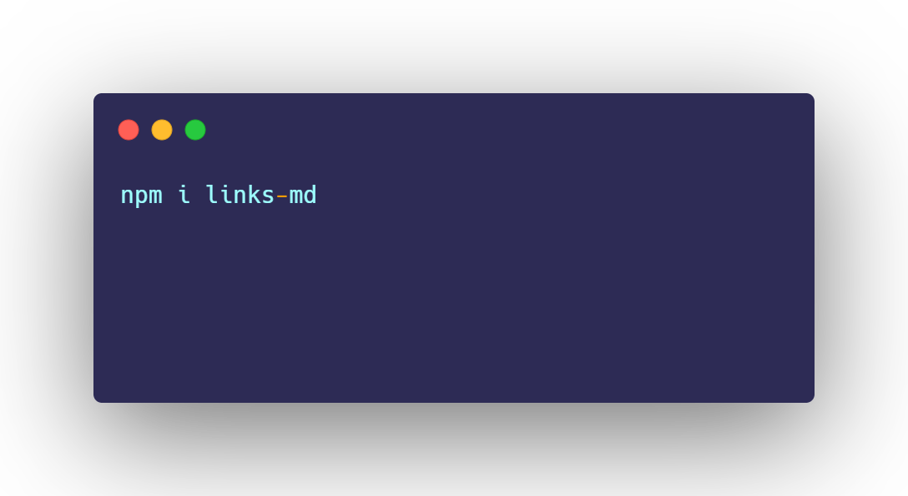
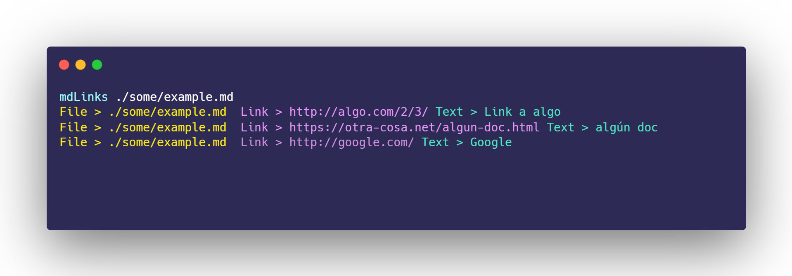
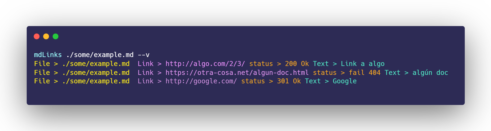
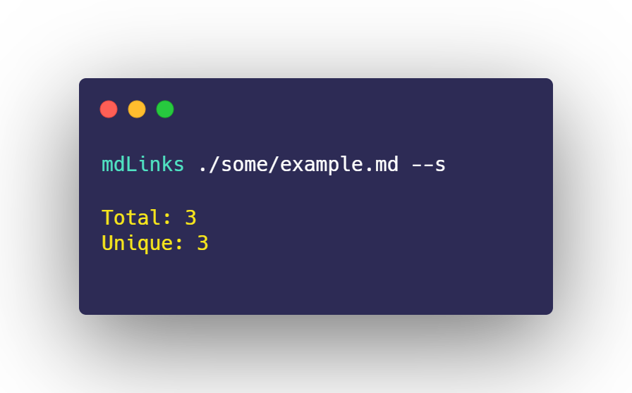
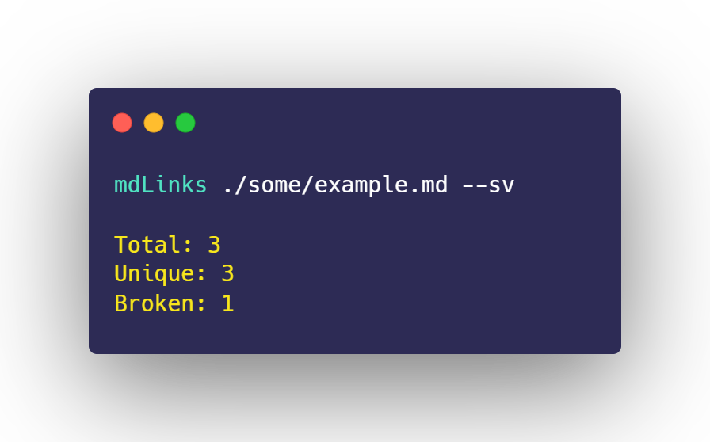
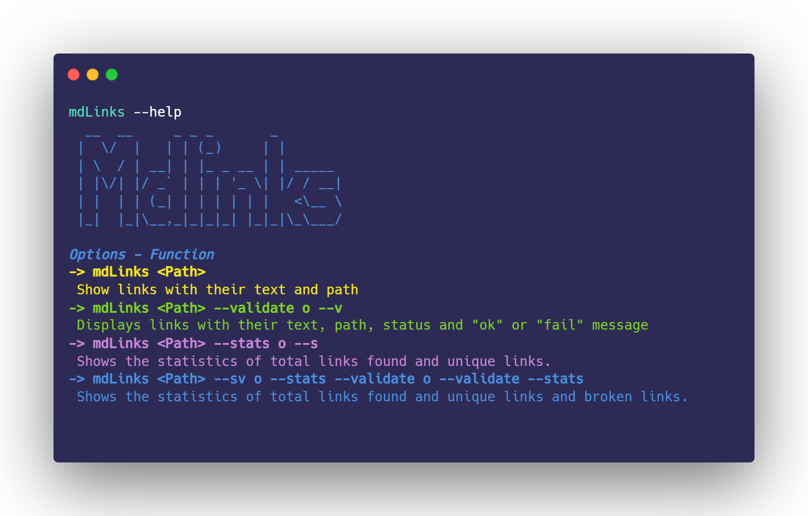

#  Markdown Links 🔗

## Sobre la libreria y Instalación 💻
Es una libreria ejecutable con node.js, extrae los links encontrados en archivos md. Así mismo, puedes ver el status de tus links y algunas estadísticas. 
Libreria npm -> [links-md](https://www.npmjs.com/package/links-md)

## Guía de uso 📖
En tu terminal, puedes ejecutar "mdLinks" y agregar una ruta, verás en tu **consola o terminal**, la ruta del archivo, link y el texto que tiene el enlace. 
<code>mdLinks < path > [options] </code>

### Validar
#### --validate o --v
Si pasas la opción <code>--validate</code> o <code>--v</code>podrás ver el status de tus links

### Estadísticas
#### --stats o --s
Si pasas la opción <code>--stats</code> o <code>--s</code> podrás ver estadísticas básicas sobre los links.

### Estadísticas y válida
#### --sv o --s --v
También se puedes usar <code>--validate --stats</code>  o <code>--stats --validate </code> o <code>--v --s</code> para obtener estadísticas que necesiten de los resultados de la validación.

### Ayuda
#### --help

**Proyecto MdLinks**
  [Lina Alvarado](https://github.com/LinaAlvarado/BOG005-md-links)
